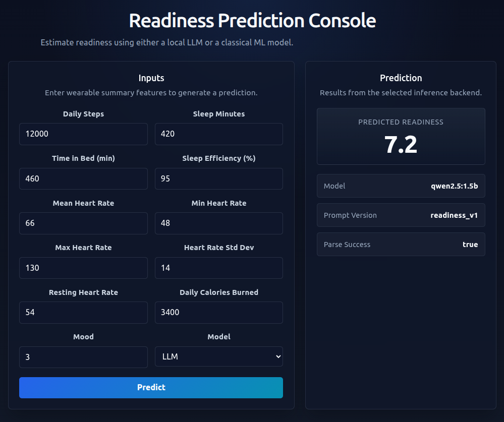

# Wearable Health

A health prediction system that estimates daily readiness from wearable sensor features using either a local LLM or classical ML models through a FastAPI backend and interactive web UI.

Initial task: readiness prediction from wearable-derived daily features such as steps, sleep, calories, heart-rate statistics, and mood.





## Features

- Predict readiness from wearable summary features
- Switch between LLM and classical ML backends
- FastAPI inference API
- React frontend for interactive testing
- Dockerized local deployment
- Notebook-based data exploration and baseline evaluation


## Limitations

This project uses limited training and use of small general purpose language models without finetuning. Hence, it is not claimed to be a software as a medical device or diagnostic tool.


## Datasets

### PMData

A lifelogging dataset of 16 persons during 5 months using Fitbit, Google Forms and PMSys.


Thambawita, V., Hicks, S.A., Borgli, H., Stensland, H.K., Jha, D., Svensen, M.K., Pettersen, S.A., Johansen, D., Johansen, H.D., Pettersen, S.D. and Nordvang, S., 2020, May. Pmdata: a sports logging dataset. In Proceedings of the 11th ACM Multimedia Systems Conference (pp. 231-236).

Dataset downloaded from : [datasets.simula.no](https://datasets.simula.no/pmdata/)


## Running The Demo

This project serves a FastAPI app backed by a local Ollama model running in Docker.

### 0. Train ML baseline

```bash
docker compose --profile training run --rm train-rf
```

### 1. Start the services

From the project root:

```bash
docker compose up --build
```

### 2. Pull the model inside the Ollama container

In another terminal:

```bash
docker ps
docker exec -it <ollama_container_name> ollama pull qwen2.5:1.5b
```

Verify the model is available:

```
docker exec -it <ollama_container_name> ollama list
```

### 3. API docs

```
http://localhost:8000/docs
```

### 4. Service Health

```
http://localhost:8000/health
```

### 5. Test readiness prediction

Example request:

```bash
curl -X POST "http://localhost:8000/predict/readiness" \
  -H "Content-Type: application/json" \
  -d '{
    "steps_daily": 12000,
    "sleep_minutes": 420,
    "time_in_bed": 460,
    "sleep_efficiency": 95,
    "hr_mean": 66,
    "hr_min": 48,
    "hr_max": 130,
    "hr_std": 14,
    "resting_heart_rate": 54,
    "calories_daily": 3400,
    "mood": 3
  }'

```

Response:

```
{"predicted_readiness":7.2,"parse_success":true,"prompt_version":"readiness_v1","model_name":"qwen2.5:1.5b","error_message":null,"raw_response":"{\"readiness\": 7.2}"}
```